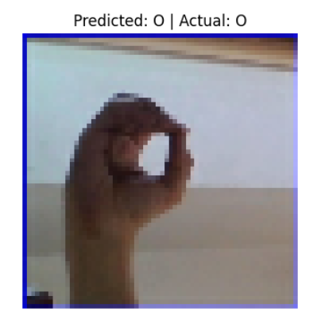
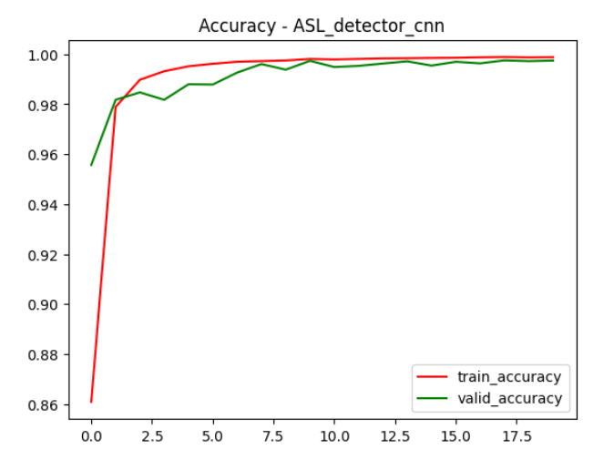
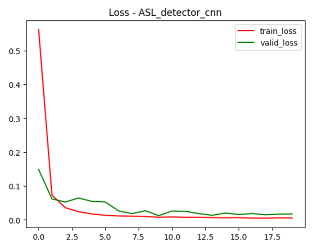

🤟 ASL Sign Language Classification (CNN)

A Deep Learning project that uses a Convolutional Neural Network (CNN) to classify American Sign Language (ASL) hand gestures.

📌 Project Overview

This project aims to recognize hand gestures representing ASL letters using image classification techniques.

🔍 What I did

- Built and trained a CNN model
- Applied image preprocessing and normalization
- Used training and validation datasets
- Evaluated model performance using accuracy and loss

📊 Results

- Achieved high validation accuracy (~99%)
- Successfully classified hand gestures from unseen images

📈 Model Training Performance

### 🔹 Prediction Example

### 📊 Accuracy Curve (Train vs Validation)

### 📉 Loss Curve (Train vs Validation)

💡 Key Insights:
- Training and validation accuracy are closely aligned → no overfitting
- Loss decreases smoothly → stable training process
- Model generalizes well on unseen data

🛠️ Tech Stack
- Python
- TensorFlow / Keras
- NumPy
- Matplotlib

🚀 Next Step

Improving model performance and deploying using Streamlit

🔗 LinkedIn Post:
[View Project post]
https://www.linkedin.com/posts/karim-deheya-776717377_deeplearning-machinelearning-ai-ugcPost-7444814423334141952-pKdD?utm_source=share&utm_medium=member_android&rcm=ACoAAF0wSIoB9lenZWcN4sIJ5OGtT-25WJFSxYk
